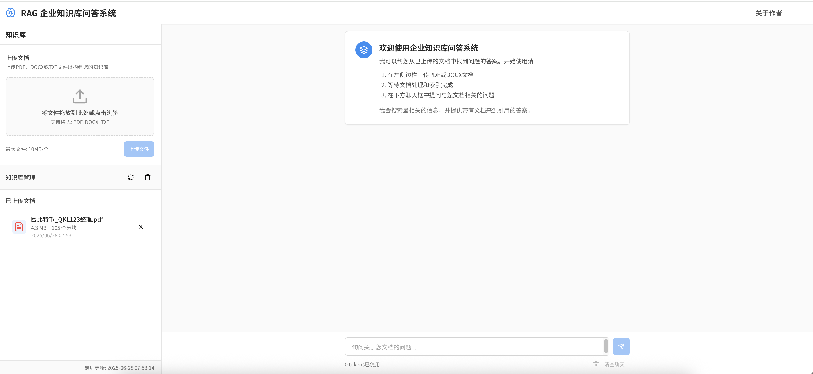

# RAG 企业知识库问答系统

🎯 在线 Demo: [https://ragsys.vercel.app](https://ragsys.vercel.app)  
📄 项目作者: [彭世雄](https://psx1.vercel.app)  
📌 说明：本项目由我独立设计并实现，旨在构建一个可部署、可演示的企业级智能问答系统，用于展示我在 AI 应用开发（前端 + 后端 + 大模型调用）方向的工程能力。

> 👇 项目截图  


---

## ✨ 项目简介

该系统基于 RAG（Retrieval Augmented Generation）架构，模拟企业内部的文件知识问答场景。用户可以上传 PDF、DOCX、TXT 等文档，系统会自动解析、向量化，并构建可查询的知识库。用户通过聊天界面提问，系统结合语义检索和大语言模型能力生成精准回答，并标明答案来源。

---

## 🚀 主要功能

- 📄 **文档上传与管理**  
  - 支持多格式文档上传（PDF, DOCX, TXT）  
  - 自动文本解析、分块、嵌入并构建向量索引  
  - 显示上传历史与知识库状态  
  - 一键清空知识库或刷新索引

- 💬 **智能问答系统**  
  - 类似 ChatGPT 的聊天交互  
  - 结合向量搜索和大语言模型生成准确答案  
  - 附带引用来源，增强可信度

- 💻 **前端体验优化**  
  - 分栏式界面（上传区 + 聊天区）  
  - 实时反馈文档状态、Token 消耗  
  - 回车发送、Shift+Enter 换行支持

---

## 🧠 技术栈与架构

**后端**：
- FastAPI（Python 3.9+）
- LangChain：大模型应用框架
- FAISS（CPU）：向量检索
- SentenceTransformers：嵌入模型
- DeepSeek API（可替换为 OpenAI 等）
- PyMuPDF, python-docx, dotenv

**前端**：
- React + TypeScript + Vite
- Tailwind CSS
- @tanstack/react-query：状态管理
- lucide-react：图标库

**部署与开发**：
- Vercel（前端）
- Railway（后端）
- Git + VS Code + venv


---

## 🛠️ 快速启动指南（本地运行）

### ✅ 环境依赖
- Python 3.9+
- Node.js (建议 LTS)
- Git

### 1. 克隆项目

```bash
git clone https://github.com/yourname/enterprise-knowledge-hub.git
cd enterprise-knowledge-hub
2. 后端启动
bash
复制
编辑
cd backend
python -m venv .venv
source .venv/bin/activate
pip install -r requirements.txt

cp .env.example .env   # 填入 DEEPSEEK_API_KEY
cd ..
python start_backend.py
3. 前端启动
bash
复制
编辑
npm install
npm run dev
访问：http://localhost:3000

🔌 API 端点简览
POST /api/upload_doc/：上传文档

GET /api/documents/：获取上传列表

POST /api/query/：发送问题并获取回答

GET /api/vector_store_size/：查看索引状态

POST /api/reset_vector_store/：清空知识库

☁️ 云部署建议
后端部署（Railway 或 Render）
使用容器部署（Docker 可选）

配置 .env 环境变量（如 DEEPSEEK_API_KEY）

持久化 index/ 与 data/ 文件夹

前端部署（Vercel）
bash
复制
编辑
npm run build
# 然后连接 Vercel 进行静态部署
🧑‍💼 关于我
欢迎访问我的个人网站查看更多项目与简历：
👉 https://psx1.vercel.app